# Proyecto: Placa PCB para Sensores en el campo de Agronomía con ESP32

## Tabla de Contenidos
1. [Introducción](#introducción)
2. [Lista de Sensores y Módulos](#lista-de-sensores-y-módulos)
3. [Proceso de Fabricación](#proceso-de-fabricación)
4. [Manual de Uso](#manual-de-uso)
5. [Recomendaciones](#recomendaciones)
6. [Enlaces Relacionados](#enlaces-relacionados)

## Introducción
Este proyecto consiste en el diseño y fabricación de una placa PCB para la lectura de múltiples sensores utilizando un **ESP32 de 38 pines**. El objetivo es centralizar la adquisición de datos ambientales y agrícolas mediante sensores como **DHT22, Soil v1.2, AM2305B, sensor NPK, flujómetro YF-S201, ML8511, MQ135**, y otros. 

La placa también integra un **módulo relé de 2 canales** para el control de dispositivos externos y un **SIM800L EVB** para comunicación GSM.

## Lista de Sensores y Módulos
1. **DHT22** - Sensor de temperatura y humedad.
2. **Soil v1.2** - Sensor capacitivo de humedad de suelo.
3. **AM2305B** - Sensor de temperatura y humedad de alta precisión.
4. **Sensor NPK** - Medición de nutrientes del suelo (Nitrógeno, Fósforo y Potasio) mediante RS485.
5. **Flujómetro YF-S201** - Medición de flujo de agua.
6. **ML8511** - Sensor de radiación ultravioleta (UV).
7. **MQ135** - Sensor de calidad del aire.
8. **Módulo relé de 2 canales** - Para control de dos dispositivos externos5. 
9. **Módulo RS485** - Modulo conversor de TTL a estándar RS485, para la lectura de datos del sensor NPK.
10. **Módulo SIM800L EVB** - Comunicación GSM/GPRS.
11. **Módulo conversor de nivel de voltaje 3.3V a 5V** - Adapta el voltaje de los sensores (5V) a los puertos de lectura analógicos del ESP32 (3.3V) para no dañarlo.

---

## Proceso de Fabricación
### 1. Diseño de la PCB
- El diseño se realizó en el programa **Proteus** en su versión 8.11.
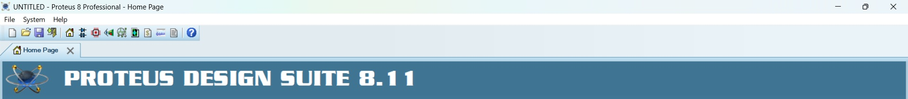

- El diseño es para una placa PCB de dos caras, en la siguiente imagen se puede observar las pistas. De color azul para las pistas de inferiores y color rojo para las pistas superiores. 
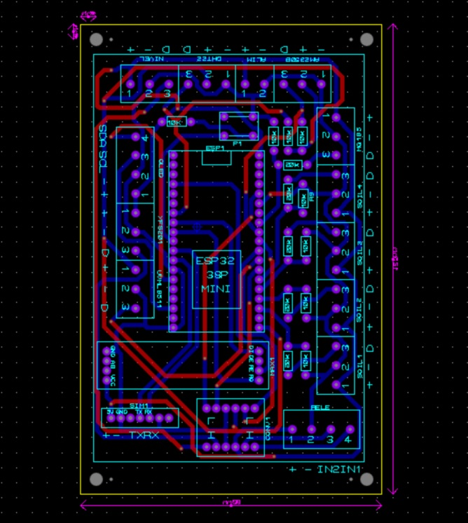

En este repositorio se encuentra la carpeta "Proteus" con todos los archivos para descargar tanto el diseño en proteus en la versión indicada como pdfs de las rutas y etiquetas, además de un .STEP para su visualización en programas CAD.

### 2. Fabricación
La PCB fue fabricada en **FR4** o mas conocida como placaPCB virgen 30cmx40cm de fibra de vidrio, con doble capa para mejorar las conexiones de los distintios componentes. Específicamente con este tamaño de placa virgen se pueden obtener 4 placas PCB. El proceso que se sigue es el siguiente:

#### Paso 1: Perforación de las placas PCB en [RouterCNC](#-routercnc).
Para que los pines de los componentes encajen correctamente a la placa PCB sin problema se hace uso de una routerCNC. En procesos de perforación y corte. Para ello se requieren conocimientos en códigoG y disponer de una máquina de este tipo.
En este repositorio se pueden descargar desde la carpeta "GCode" los códigosG para las operaciones de perforación y corte de 4 placas PCB. 
Todas las operaciones se deben realizar con un solo origen de coordenadas.

Los archivos con el nombre "Perfos" que van del 1 al 8 se deben ejecutar primero secuencialmente.

Los archivos con el nombre "Bordes" que van del 1 al 4 se deben ejecutar luego de las perforaciones secuencialmente.

Se debe perforar las esquinas con broca de 3mm.

Se debe hacer 4 perforaciones al lado de las perforaciones de las esquinas esto como sujetadores con broca de 0.3mm.

Se debe hacer las perforaciones para los remaches con broca de 1mm.

Para las demas perforaciones se hace uso de una broca de 1.2mm.

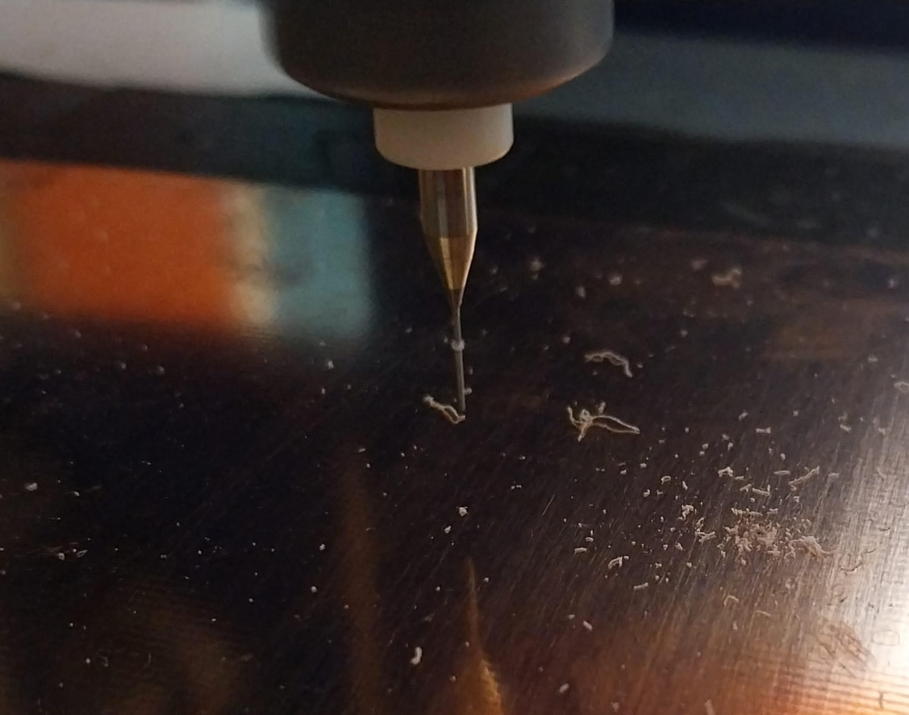

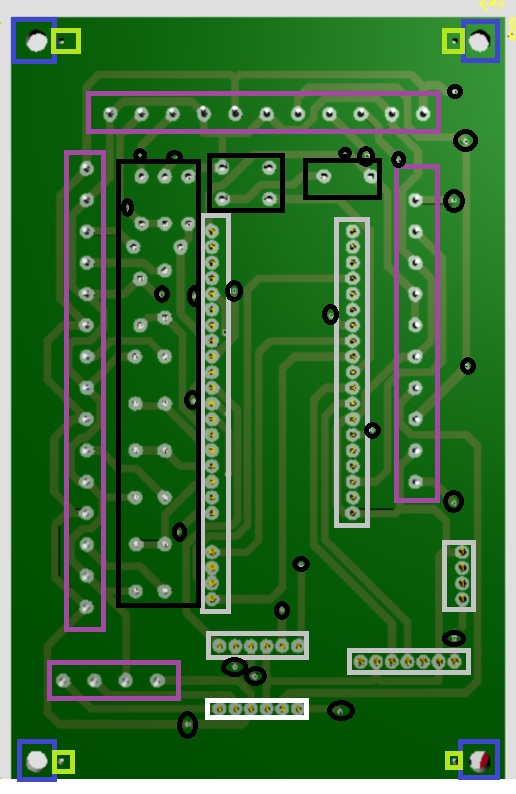

#### Paso2: Impresión láser de las pistas y etiquetas
En la carpeta Proteus de este repositorio se pueden encontrar los PDFs con las pistas de la placa las cuales se deben imprimir en **láser** en papel transfer que se pueden comprar en tiendas de electrónica. También esta el PDF para imprimir en láser preferiblemente las etiquetas en papel sticker. 
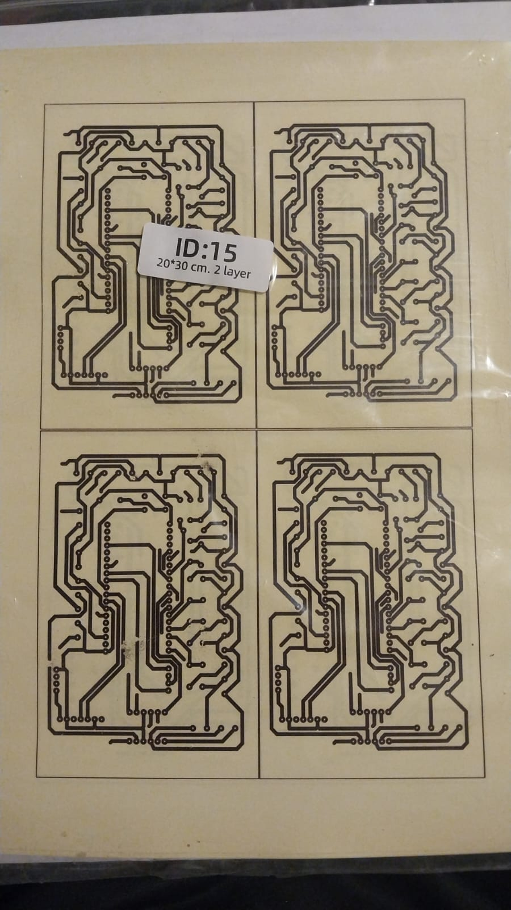

#### Paso3: Transferencia de las pistas a la placa PCB
- Para este paso se hace uso del método de fabricación de placas PCB por planchado. Existen varios videos en internet que explican detalladamente como realizarlo.
- La importancia de la impresión de las pistas en láser se verán en este paso. Para transferir las pistas a la placa PCB se debe alinear el diseño de la hoja transfer con las perforaciones hechas en la placa PCB con routerCNC. 
- Posteriormente asegurar la hoja a la placa de forma que esta no se mueva y pasar con plancha de ropa por almenos 10minutos. Hasta comprobar que la impresión se paso correctamente a la placa PCB.
- Hacer eso para las dos caras asegurandose en todo momento que el diseño está alineado con las perforaciones.
- Luego sumergir la placa PCB en ácido férrico. El mismo eliminará el cobre en la placa, para solo dejar el diseño de las pistas transferidas.

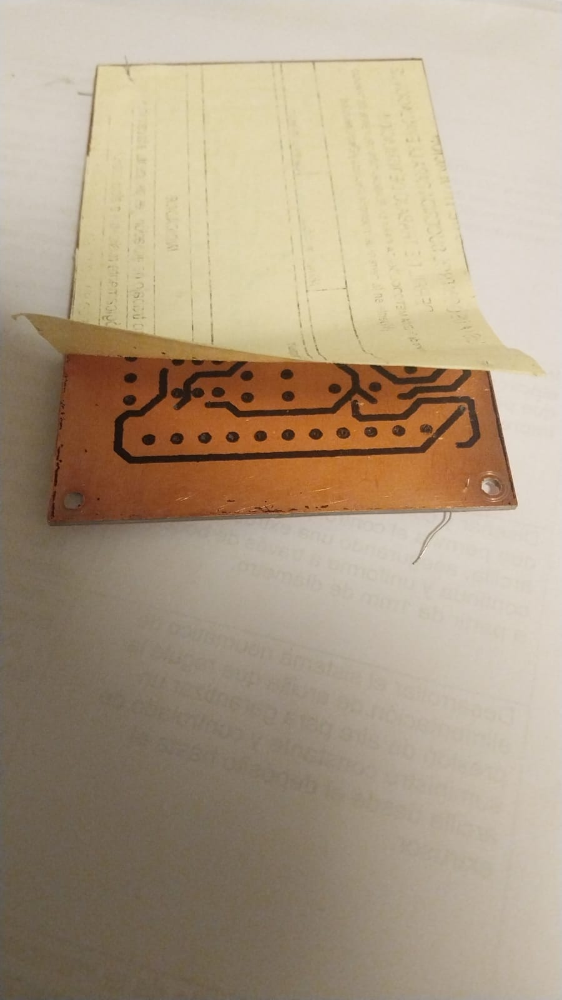
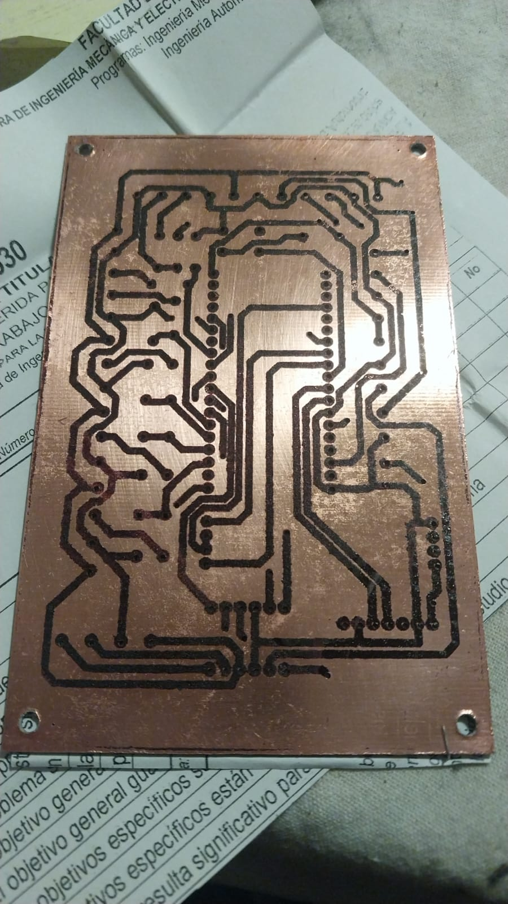

### 3. Ensamblaje
- Pegar el diseño en papel sticker sobre la placa PCB para guiar las conexiones.
- Posicionar los distintos elementos como ser borneras, resistencias, el pulsador y headers en las perforaciones.
- Soldar todos los componentes.
- Una vez soldados todos los componentes limpiar la placa PCB con alcohol isopropílico para evitar cortocircuitos y eliminar todo residuo que haya quedado.

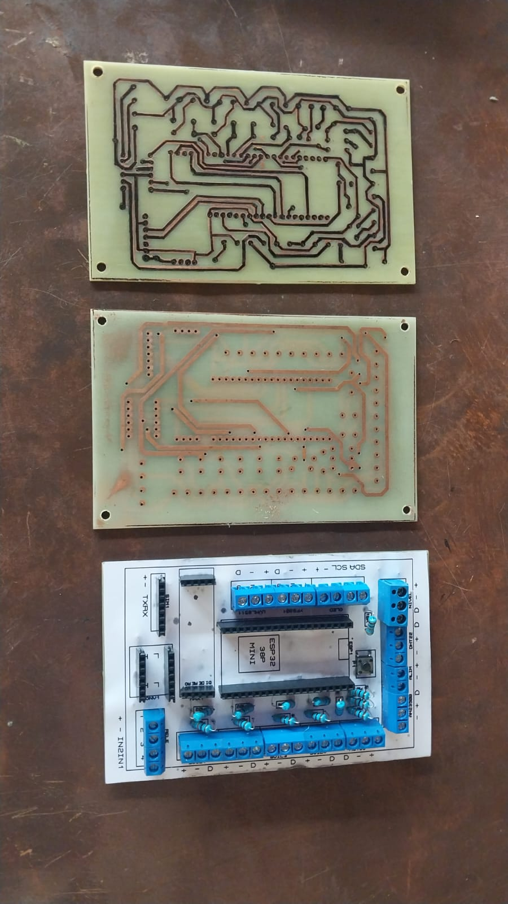

### 4. Pruebas
- Una vez finalizado con la limpieza de las placas y haciendo uso de un multímetro comprobar las conexiones entre pistas, caras, pines, etc.
- Conectar los sensores, módulos y el ESP32 con el código cargado al mismo y comenzar a probar los datos recibidos en el IDE de Arduino.

---

## Manual de Uso
### 1. Vista de la placa PCB en 3D en Proteus
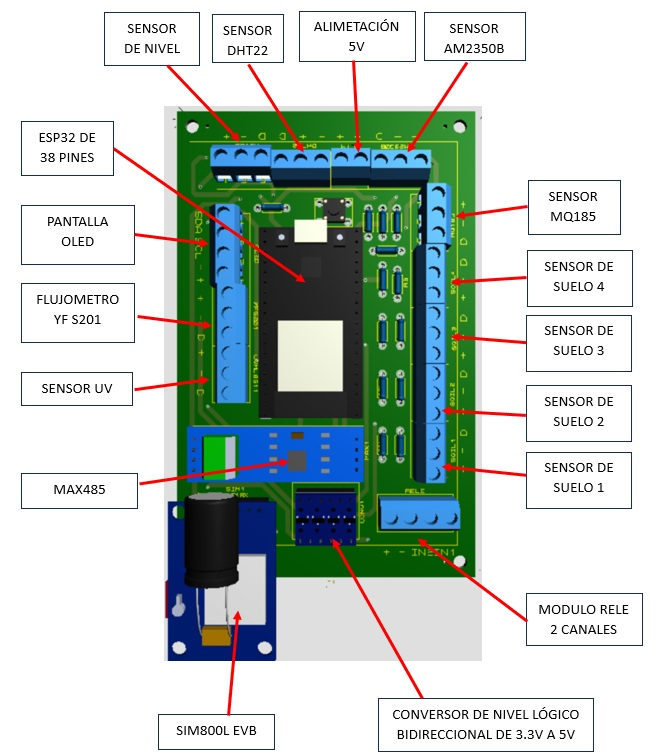
Como se puede observar en la imagen superior, se etiquetaron los elementos que van montados en la placa PCB como ser el ESP32, el MAX485, el SIM800L EVB y el conversor de nivel lógico. Además se muestran las borneras a las que van conectados los distintos sensores y actuadores.

### 2. Vista de la placa PCB en Físico
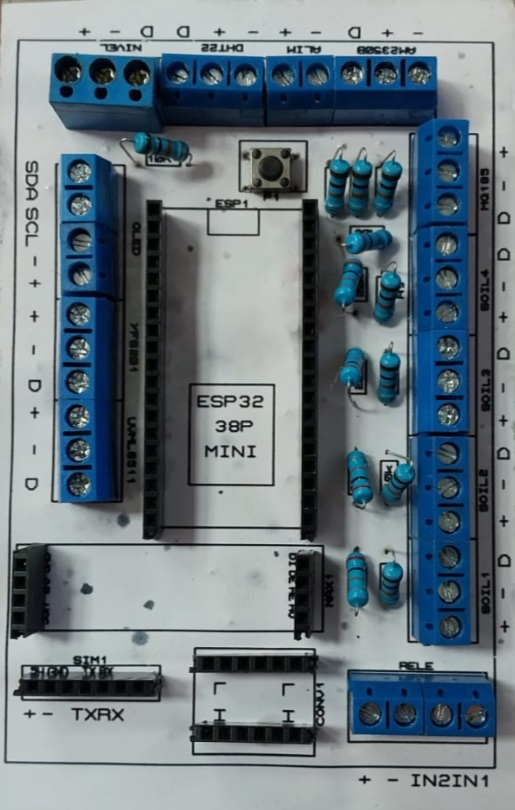

En la imagen de la placa física se pueden observar diferentes leyendas, las mismas se detallan a continuación:

### Leyenda ESP32 38P MINI
Sirve para identificar la orientación con la que se debe conectar el ESP32, ya que encima de dicha leyenda se puede observar un cuadrado pequeño y encima del mismo la palabra "ESP1". Se debe hacer coincidir el jack de conexión del ESP32 que debe ir encima de este cuadrado.
### Leyenda "+"
Hace referencia a que dicho pin de conexión tiene salida de 5V o 3.3V según el diseño.
### Leyenda "-"
Hace referencia a que dicho pin de conexión está conectado a tierra de la placa conocido como "GND".
### Leyenda "D"
Hace referencia a que dicho pin de conexión está dedicado a conectar con un pin analógico o digital del ESP32, es decir, en este pin se conecta el pin de datos de los sensores.
### Leyenda "IN1 IN2"
Hace referencia a las conexiones IN1 e IN2 presentes en el módulo Relé de 2 canales en los que cada "IN" controla la conmutación de cada relé.
### Leyenda "L H"
Hace referencia a la orientación con la que se debe conectar el conversor de nivel lógico, ya que en su placa se observan dos filas. Las LV que son de nivel de voltaje "bajo" de 3.3V y las LH que son de nivel de voltaje "alto" de 5V. Por lo que es importante saber en que sentido se debe conectar el conversor de nivel lógico para no dañar los componentes.
### Leyenda "TX RX"
Hace referencia a los pines de conexión del SIM800L, ya que en su placa se puede observar las mismas leyendas.
### Leyenda "DI DE RE RO"
Hace referencia a las conexiones "DI DE RE RO" presentes en el módulo RS485, indicando que dichos pines del módulo deben ir conectados a esa parte.
### Leyenda "[SDA](#-sda) [SCL](#-scl)"
Hace referencia a las conexiones "SDA SCL" presentes en los módulos de pantallas LCD u OLED.
### Leyendas "10k o 20k"
Hacen referencia a los valores de resistencias que se deben montar en la placa PCB.

---

A continuación se detallan aspectos importantes de cada leyenda de los dispositivos que se pueden conectar a la placa PCB :

- ***NIVEL*** -> **SENSOR DE NIVEL** - Bornera de 3 pines. Esta entrada puede trabajar en configuración [Pull-up](#-pull-up) o [Pull-down](#-pull-down) de forma externa, es decir, no esta integrada la resistencia en la placa, por lo que este arreglo debe hacerse a parte. Dedicado para la conexión de un sensor de nivel con salida digital.
- ***DHT22*** -> **SENSOR DE TEMPERATURA Y HUMEDAD DTH22** - Bornera de 3 pines. Se puede conectar directamente el sensor DHT22.   
- ***ALIM*** -> **ALIMENTACIÓN A TODA LA PLACA** - Bornera de 2 pines. Acá se conecta la fuente de alimentación de 5V para todos los componentes como los sensores, el esp32, los actuadores, etc.
- ***AM2305B*** -> **SENSOR DE TEMPERATURA Y HUMEDAD AM2305B** - Bornera de 3 pines. Se puede conectar directamente el sensor AM2305B.
- ***MQ135*** -> **SENSOR DE CALIDAD DE AIRE MQ135** - Bornera de 3 pines. Se puede conectar directamente el sensor MQ135.
- ***SOIL1 SOIL2 SOIL3 SOIL4*** -> **SENSOR CAPACITIVO DE HUMEDAD DE SUELO SOIL V1.2** - Bornera de 3 pines. Se puede conectar directamente el sensor SOIL V1.2. La placa soporta hasta 4 sensores de este tipo numerados del 1 al 4.
- ***RELE*** -> **MODULO RELÉ DE 2 CANALES** - Bornera de 4 pines. Se puede conectar directamente el módulo relé de 2 canales de 5V. Importante que el módulo relé sea de 5V ya que otros voltajes no funcionaran correctamente.
- ***CONV1*** -> **CONVERSOR DE NIVEL LÓGICO BIDIRECCIONAL 3.3V A 5V** - [2 Headers de 6 pines](#-Header). Se puede conectar directamente el módulo conversor.
- ***MAX1*** -> **MÓDULO SERIAL RS485** - 2 headers de 4 pines. Se puede conectar directamente el módulo [RS485](#-RS485) cuya orientación se detalló anteriormente. Este módulo cuenta con 1 bornera de color verde, a la misma se le debe conectar los cables del NPK (Cable Azul a pin B) (Cable Amarillo a pin A).
- ***SIM1*** -> **MÓDULO SIM800 EVB** - 1 header de 7 pines. Se conecta directamente el módulo SIM800L cuya orientación se detalló anteriormente.
- ***UVML8511*** -> **SENSOR DE RADIACIÓN UV ML8511** - Bornera de 3 pines. Se puede conectar directamente el sensor ML8511.
- ***YFS201*** -> **SENSOR DE FLUJO DE AGUA YF-S201** - Bornera de 3 pines. Se puede conectar directamente el sensor YF-S201.
- ***OLED*** -> **PANTALLA LCD U OLED** - Bornera de 4 pines. Se puede conectar directamente cualquier tipo de pantalla que maneje [protocolo I2C](#-protocolo-i2c).
- ***P1*** -> **PULSADOR DE 4 PINES** - Por último la placa cuenta con un pulsador de 4 pines para el reinicio del sensor DHT22 a través de uno de los relés. Este pulsador esta en configuración pull-up, y es multipropósito, es decir, mediante código se le puede asignar alguna otra tarea. Es recomendable usar un pulsador de 4 pines, si se desea usar un pulsador de 2 pines, se debe cortocircuitar 2 pines en la placa. ya que el pulsador de 4 pines tiene 2 de sus pines cortocircuitados.
 
---

### 2. Configuración del Código
El código para el ESP32 esta subido en este repositorio.

Para su compilación de forma correcta hay que asegurarse de los siguientes aspectos:

#### 2.1 Descargar el controlador de la placa 
-	Descargar el controlador de la placa ESP32: [https://www.pololu.com/docs/0j7/all]

#### 2.2 Permitir la instalación del ESP32 en el gestor de placas de Arduino.
- Añadir la siguiente dirección en preferencias de ArduinoIDE https://dl.espressif.com/dl/package_esp32_index.json
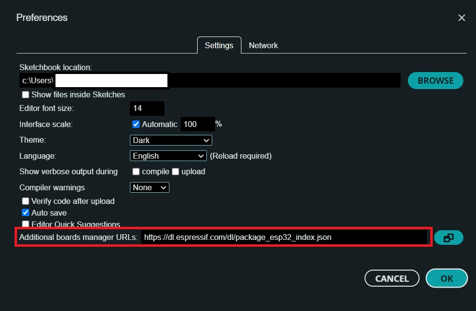

-	Descargar el gestor de tarjetas ESP32 by Espressif
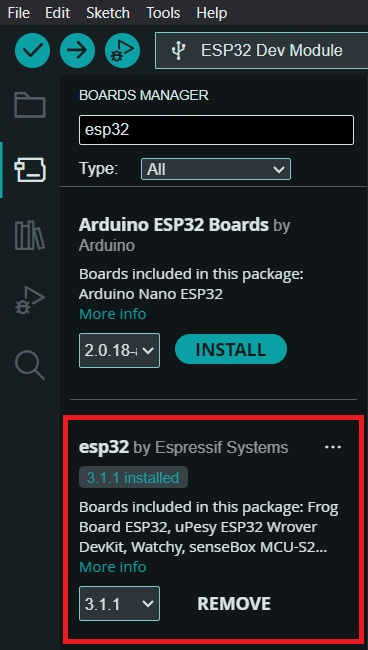

#### 2.3 Se debe incluir librerías como:
-	Descargar y añadir el .zip para la librería del sensor de humo MQ135 (Guardar el .rar en la carpeta Librerías de Arduino en Documentos): [https://github.com/GeorgK/MQ135]
- Instalar las siguientes librerías:
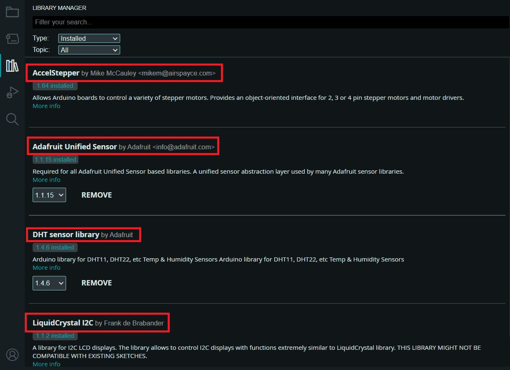

#### 2.4 Subir el código a través de **Arduino IDE** o **PlatformIO**.

### 3. Comunicación y Monitoreo
Los datos pueden ser enviados vía **GSM (SIM800L)** o registrados en un servidor vía WiFi.

## Recomendaciones
- Utilizar fuentes de alimentación estables para evitar fluctuaciones en la lectura de sensores.
- Asegurar conexiones firmes en los bornes de la PCB.
- Conectar correctamente los cables del NPK al RS485.
- Alimentar el NPK con voltaje de 12V a 24V.

## Enlaces Relacionados
[Costos](https://docs.google.com/spreadsheets/d/1o4OIqn2UZ5dTwx130ju8cEiu5RzT9XGlmn1_-c5960o/edit?usp=sharing)

---

## 📖 Glosario

### 🔹RouterCNC
Un Router CNC es una máquina de control numérico computarizado (CNC) utilizada para cortar, grabar y mecanizar materiales como madera, acrílico, aluminio y plásticos con alta precisión.

### 🔹 Pull-up
Pull-up (o resistencia pull-up) es una resistencia (en este caso de 10k) conectada entre el pin de datos de un circuito y el voltaje de alimentación (+), utilizada para asegurar que el pin se mantenga en un nivel lógico alto (1) cuando no está activamente conducido por otro componente.

### 🔹 Pull-down
Pull-down (o resistencia pull-down) es una resistencia conectada entre un pin de datos de un circuito y GND (-) para asegurar que el pin se mantenga en un nivel lógico bajo (0) cuando no está siendo activamente controlado por otro componente.

### 🔹 Header
Un header (o conector tipo header) es un conjunto de pines en fila que se usan para conectar módulos, sensores o cables en una placa PCB o un protoboard.

### 🔹 RS485
Un módulo RS485 es un convertidor que permite la comunicación serie utilizando el protocolo RS485, un estándar industrial para transmisión de datos en larga distancia y en ambientes con ruido eléctrico.

### 🔹 Protocolo I2C
El I2C (Inter-Integrated Circuit) es un protocolo de comunicación serie que permite la conexión de múltiples dispositivos usando solo dos líneas: SDA y SCL

### 🔹 SDA
SDA (Serial Data) → Transporta los datos.

### 🔹 SCL
SCL (Serial Clock) → Marca el ritmo de la transmisión.

---

**Autor**: [Gabriel Duran Maldonado] 
**Fecha**: [24-02-25]
